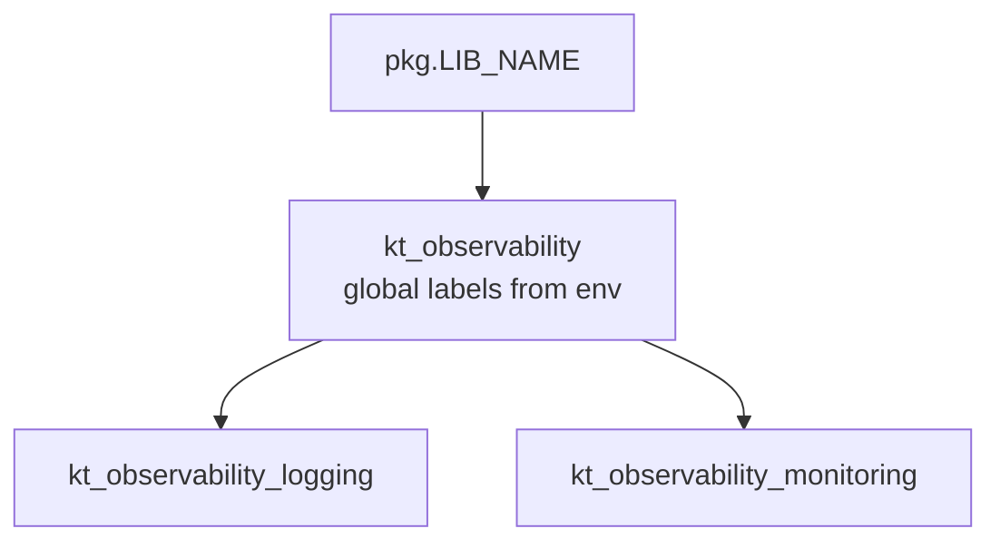

# Architecture — lib-observability-golang

- Last modified: 2026-07-25
- This doc was generated by AI agent

## What changed vs previous

- Initial Architecture documentation for the v2.x line of this library (no prior Architecture doc).

## TLDR

`lib-observability-golang` is a shared observability helper for Keytiles Go services. It standardizes:

- **Global labels** shared by logs and Prometheus metrics
- **Logging helpers** that turn those labels into `kt_logging.Label`s
- **Metrics helpers** that expose Prometheus metrics via a template → instance model (so dashboards stay maintainable)

It builds on [lib-logging-golang](https://github.com/keytiles/lib-logging-golang) and [prometheus/client_golang](https://github.com/prometheus/client_golang).

## Package map

- `pkg` — library identity (`LIB_NAME = "keytiles.lib.observability"`)
- `pkg/kt_observability` — shared foundation: builds the default **global labels** map from environment variables
- `pkg/kt_observability_logging` — Logging feature: map → log labels (see [LoggingObservability-v2.0.md](LoggingObservability-v2.0.md))
- `pkg/kt_observability_monitoring` — Metrics feature: registry, templates/instances, HTTP client/server helpers (see [MetricsObservability-v2.1.md](MetricsObservability-v2.1.md))

## Global labels

Services usually want the same key-value pairs on every log event and every metric series, for example:

- `serviceName` — from `SERVICE_NAME`, else `CONTAINER_NAME`, else `"?"`
- `serviceVer` — from `SERVICE_VERSION`, else `CONTAINER_VERSION`, else `"?"`
- `host` — from `HOSTNAME`, else `"?"`
- `instId` — from `INSTANCE_ID`, else `"?"`

`kt_observability.BuildGlobalLabelsMap()` builds that map. Both features consume it:

- Logging: `BuildDefaultGlobalLogLabels()` / `BuildLogLabels(...)` then `kt_logging.SetGlobalLabels(...)`
- Metrics: `InitMetrics()` sets them as Prometheus const labels on templates (override via `SetGlobalLabels`)

## How logging and metrics relate

They are independent features with a shared label foundation:

- You can use logging helpers without metrics, and vice versa
- Using the same global label map on both sides keeps filtering consistent in log stores and Grafana

Typical service startup shape:

1. Build or customize a global labels map
2. Register them on the logger
3. Call `InitMetrics()` (and optionally `SetGlobalLabels`)
4. Create metric instances from predefined templates (or use HTTP lazy metric sets)
5. Expose `MetricRegistry` via `promhttp` (see the example app)

## Example application

A runnable demo lives at [examples/simple-service](../examples/simple-service/). It shows:

- Shared global labels on logs and metrics
- Predefined counters/summaries with simulated business work
- `HttpServerLazyMetricsSet` on simple HTTP handlers
- Prometheus scrape endpoint on `:9008/metrics`

## Automated tests

Happy-path coverage (asserted, CI-friendly) lives under:

- [tests/kt_observability_logging](../tests/kt_observability_logging/)
- [tests/kt_observability_monitoring](../tests/kt_observability_monitoring/)

## Related docs

- [LoggingObservability-v2.0.md](LoggingObservability-v2.0.md)
- [MetricsObservability-v2.1.md](MetricsObservability-v2.1.md)
